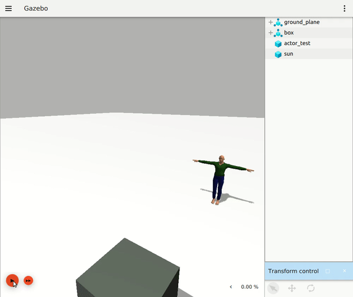
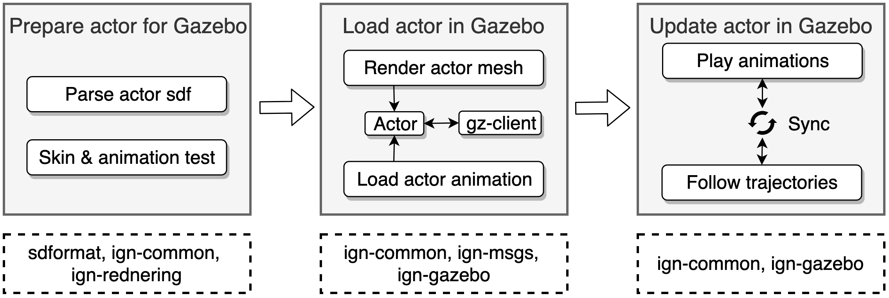
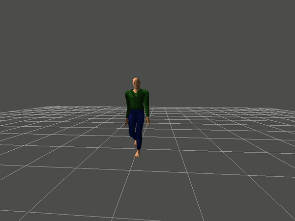
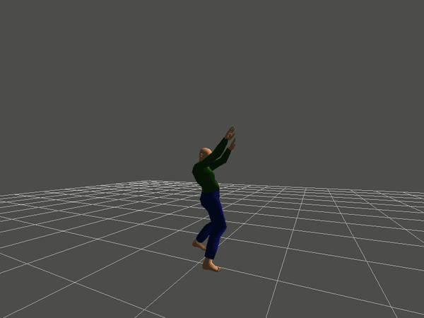

## Introduction

Gazebo is being migrated to Ignition Robotics, which is a refactor of Gazebo's source code, breaking it into smaller reusable libraries and making them more powerful and flexible in the process. This project is about migrating skeleton animation, i.e. actors, so they can be loaded into Ignition Gazebo. The work will involve making sure that Collada skins and animations, as well as BVH animations, are loaded and animated correctly using SDFormat, Ignition Rendering and Ignition Common.

## Quick Overview

### What is done?
**Actor simulation** is now supported in Ignition Gazebo. The actor can be loaded from **Collada files (.dae)**, and the actor animations can be specified by both Collada files (.dae) and **BVH files (.bvh)**. We also add support to allow the **Actor follow predefined trajectories**. 

### Any demo?



### How to use?
* By including the actor model from the Fuel (check [usage](#usage) for more details), e.g.,:

``` xml
<include> 
    <uri>https://fuel.ignitionrobotics.org/1.0/Mingfei/models/actor</uri>
</include>
```

* By creating actor in the sdf file (check [usage](#usage) for more details), e.g., 

``` xml
<actor name="actor">
    <skin>
      <filename>YOUR_SKIN_FILENAME</filename>
    </skin>
    .... <!-- check following [usage] more details -->
</actor>
```

## Implementations

The whole project consists of three phases, as illustrated in the figure below: 



### Prepare actor for Gazebo
This phase consists of two parts: parsing actor sdf and testing the skins and animations. 

The parsing process is standard: first obtain values from xml tag given by the [definition](https://bitbucket.org/osrf/sdformat/src/default/sdf/1.6/actor.sdf), and then populate the properties with these values in `sdformat`. This parsing process is to prepare necessary information for Gazebo to load the actor.

The testing process is to check how to render meshes according to the rendering engine. An example of rendering the actor mesh is implemented in `ign-rendering`, i.e., [actor_animation](). This example tests how an actor mesh can be loaded from the Collada file, and how the animations can be played both from Collada files and BVH files. The following functions were added to class `ignition::common::Skeleton` and `ignition::rendering::Mesh` to make this example work (see [ign-common PR](https://bitbucket.org/ignitionrobotics/ign-common/pull-requests/197) & [ign-rendering PR](https://bitbucket.org/ignitionrobotics/ign-rendering/pull-requests/184) for more details):

* `ignition::rendering::Mesh::HasSkeleton`: whether the Mesh has a skeletal structure associated with it
* `ignition::rendering::Mesh::SkeletonLocalTransforms`: get the local transformations of the mesh skeleton
* `ignition::rendering::Mesh::SetSkeletonLocalTransforms`: set the local transformations of the mesh skeleton
* `ignition::common::Skeleton::AddBvhAnimation`: Add an animation from BVH file
* `ignition::common::NodeNameAnimToSkin`: Finding the skin node name that corresponds to the given animation node name
* `ignition::common::AlignTranslation`: Get the transformation to align translation from the animation skeleton to skin skeleton
* `ignition::common::AlignRotation`: Get the transformation to align rotation from the animation skeleton to skin skeleton

Note that the `ignition::rendering` functions only provide a high-level abstraction of APIs that need to be implemented based on the rendering engines. This project only implemented the rendering functions for Ogre engine, and the implementations for other engines, e.g., Ogre2, are left as future work. Furthermore, for the BVH animation to be correctly loaded to Collada animation, some additional frame alignments, i.e., translations and rotations, need to be made between the animation skeleton and Collada skeleton. 

The following gifs show the rendering results (with Ogre engine). 

* Skin and animation both from a single Collada file:



* Skin from a Collada file and animation from a BVH file



Note that this rendering of actor is a standalone example (not in Gazebo). 

### Load actor in Gazebo
The rendering of actor in Gazebo needs two more steps. The first step is to load the mesh and animations based on the input sdf, and the second step is to bridge the communication between the gz-client and the gz-server so that the actor can be visually presented at the client side.

1. Step 1: Load the mesh and animations according to the sdf, see [ign-gazebo PR](https://bitbucket.org/ignitionrobotics/ign-gazebo/pull-requests/414):
 * `ignition::gazebo::SdfEntityCreator::CreateEntities`: Create all entities that exist in the sdf::Actor object and load their plugins.
 * `ignition::gazebo::SceneManager::CreateActor`: Create an actor
 * `ignition::gazebo::SceneManager::ActorMeshById`: Get a rendering mesh given an id
 * `ignition::gazebo::SceneManager::ActorMeshAnimationAt`: Get the animation of actor mesh given an id

2. Step 2: Communication between the *gz-client* and the *gz-server*, see [ign-gazebo PR](https://bitbucket.org/ignitionrobotics/ign-gazebo/pull-requests/414) & [ign-msgs PR](https://bitbucket.org/ignitionrobotics/ign-msgs/pull-requests/147):
 * `ignition::msgs::Actor`: new message proto, including Animation, Waypoint, Trajectory and Actor
 * `ignition::gazebo::components::Actor`: This component contains actor source information. 
 * `ignition::gazebo::convert`: conversion between an actor message and an actor


### Update actor in Gazebo
The updating of an actor requires to update the global pose (i.e., following trajectories) in the world and the skeleton transformations (i.e., playing animations) in the local frames. These two process need to be synchronized to avoid any misalignment between the two poses (the global pose and the local pose). For example, if the walking animation (local poses) is not synchronized with the actor world pose (global pose), the actor may appear to be sliding on the floor rather than walking. 

To synchronize the trajectory following and animation playing, a new class, `TrajectoryInfo`, was created under the same file with `common::Animation`, see [ign-common PR](https://bitbucket.org/ignitionrobotics/ign-common/pull-requests/197). 
* `ignition::common::TrajectoryInfo`: Information about a trajectory for an animation (e.g., Actor). This contains the keyframe information. 

The class `TrajectoryInfo` has a member function `DistanceSoFar` to caculate the elapsed distance in the trajectory. The elapsed distance is used to interpolate the local transformations in `SceneManager::ActorMeshAnimationAt` so that the local animation transformations are aligned with the global actor poses. Then the actor pose is updated in `RenderUtil::Update` as follows:

``` C++
for (auto &tf : actorTransforms)
{
  auto actorMesh = this->dataPtr->sceneManager.ActorMeshById(tf.first);
  auto actorVisual = this->dataPtr->sceneManager.NodeById(tf.first);
  if (!actorMesh || !actorVisual)
    continue;

  math::Pose3d actorPose;
  actorPose.Pos() = tf.second["actorPose"].Translation();
  actorPose.Rot() = tf.second["actorPose"].Rotation();
  actorVisual->SetLocalPose(actorPose);
  tf.second.erase("actorPose");
  actorMesh->SetSkeletonLocalTransforms(tf.second);
}
```

Below is a demo to show the synchronized result. 


Several common actor models are created in the [Fuel](https://app.ignitionrobotics.org/fuel/models) for quick demonstrations and fast prototypings. 

* actor: https://app.ignitionrobotics.org/Mingfei/models/actor
* actor_gesture: https://app.ignitionrobotics.org/Mingfei/models/actor_gesture
* actor_moonwalk: https://app.ignitionrobotics.org/Mingfei/models/actor_moonwalk
* actor_run: https://app.ignitionrobotics.org/Mingfei/models/actor_run
* actor_sitting: https://app.ignitionrobotics.org/Mingfei/models/actor_sitting
* actor_sit_down: https://app.ignitionrobotics.org/Mingfei/models/actor_sit_down
* actor_stand_up: https://app.ignitionrobotics.org/Mingfei/models/actor_stand_up
* actor_stand: https://app.ignitionrobotics.org/Mingfei/models/actor_stand
* actor_talk_a: https://app.ignitionrobotics.org/Mingfei/models/actor_talk_a
* actor_talk_b: https://app.ignitionrobotics.org/Mingfei/models/actor_talk_b
* actor_walk: https://app.ignitionrobotics.org/Mingfei/models/actor_walk

## Usage
There are two ways to load an actor. One is to use the existing models in the [Fuel](https://app.ignitionrobotics.org/fuel/models). Another is to explicitly create an actor tag in the sdf file. 

### Using existing models
Below are actor-related models from the Fuel:

* An actor following a sequence of trajectories with different animations: [actor](https://app.ignitionrobotics.org/Mingfei/models/actor)
* An actor with BVH animation: [actor_gesture](https://app.ignitionrobotics.org/Mingfei/models/actor_gesture)
* Moonwalking actor [actor_moonwalk](https://app.ignitionrobotics.org/Mingfei/models/actor_moonwalk)
* Running actor [actor_run](https://app.ignitionrobotics.org/Mingfei/models/actor_run)
* Sitting actor [actor_sitting](https://app.ignitionrobotics.org/Mingfei/models/actor_sitting)
* Actor is sitting down [actor_sit_down](https://app.ignitionrobotics.org/Mingfei/models/actor_sit_down)
* Actor is standing up [actor_stand_up](https://app.ignitionrobotics.org/Mingfei/models/actor_stand_up)
* Standing actor [actor_stand](https://app.ignitionrobotics.org/Mingfei/models/actor_stand)
* Talking actor [actor_talk_a](https://app.ignitionrobotics.org/Mingfei/models/actor_talk_a)
* Talking actor [actor_talk_b](https://app.ignitionrobotics.org/Mingfei/models/actor_talk_b)
* Walking actor [actor_walk](https://app.ignitionrobotics.org/Mingfei/models/actor_walk)

To use the above model, we include the model in the sdf file. For example, the following lines use the actor which follows a sequence of trajectories with different animations:

``` xml
<include> 
    <uri>https://fuel.ignitionrobotics.org/1.0/Mingfei/models/actor</uri>
</include>
```

### Using actor tag
The actor can also be manully specified in the sdf models, .e.g., 

``` xml
<actor name="actor">
    <pose>0 0 1.1 0 0 0</pose>
    <skin>
      <filename>YOUR_SKIN_FILENAME</filename>
      <scale>1.0</scale>
    </skin>
    <animation name="animation_name">
      <filename>YOUR_ANIMATION_FILE(support dae and bvh format)</filename>
      <scale>1.0</scale>
      <interpolate_x>true</interpolate_x>
    </animation>
    <script>
      <loop>true</loop>
      <delay_start>1.0</delay_start>
      <auto_start>true</auto_start>
      <trajectory id="0" type="animation_name">
        <waypoint>
          <time>0</time>
          <pose>0 0 1.0 0 0 0</pose>
        </waypoint>
        <waypoint>
          <time>3</time>
          <pose>0 0 1.0 0 0 0</pose>
        </waypoint>
      </trajectory>
    </script>
</actor>
```

## Code release

**Actor-related PRs**:

All Actore-related PRs of this project are listed below. 

* Ign-msgs: https://bitbucket.org/ignitionrobotics/ign-msgs/pull-requests/147 [Released in ign-msgs 4.6.0]
* sdformat: https://bitbucket.org/osrf/sdformat/pull-requests/547 [Released in SDFormat 8.3.0]
* Ign-common: https://bitbucket.org/ignitionrobotics/ign-common/pull-requests/197 [Released in ign-common3]
* Ign-rendering: https://bitbucket.org/ignitionrobotics/ign-rendering/pull-requests/184 [Released in ign-rendering3]
* Ign-gazebo: https://bitbucket.org/ignitionrobotics/ign-gazebo/pull-requests/414 [Released in ign-gazebo3]

**Documentation-related PRs**:

This project also created PRs to improve the readability of the installation docs. 

* https://bitbucket.org/ignitionrobotics/docs/pull-requests/20
* https://bitbucket.org/ignitionrobotics/docs/pull-requests/21
* https://bitbucket.org/ignitionrobotics/docs/pull-requests/25

**Other bug-related PRs**:

This project also solves several bugs in existing repositories. 

* Ign-transport: https://bitbucket.org/ignitionrobotics/ign-transport/pull-requests/388
* Ign-common: https://bitbucket.org/ignitionrobotics/ign-common/pull-requests/195
* Ign-gui: https://bitbucket.org/ignitionrobotics/ign-gui/pull-requests/214/

## Future work: 

* Support Ogre2
* Support plugins for actor